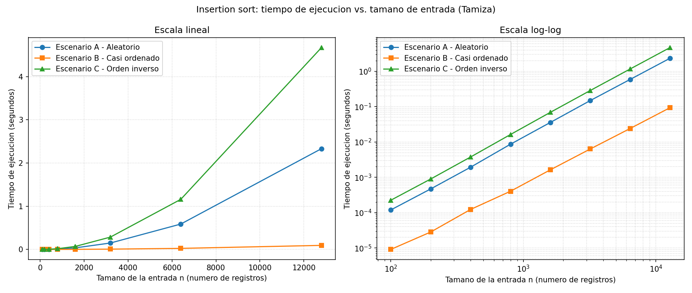
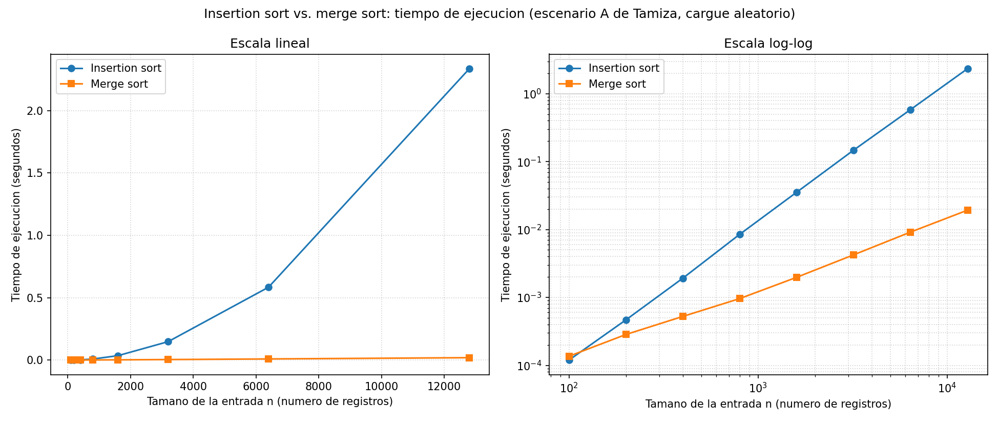

# Laboratorio evaluativo 01 — Fundamentos, complejidad y recurrencias

**Autor:** Jhon Eduardo Zabala Garzon
**Correo:** jhonzabala329026@correo.itm.edu.co
**Grupo de Análisis:** 190304006-1
**Caso analizado:** plataforma Tamiza — Secretaría de Salud departamental

---

## Cómo reproducir el experimento

Todo el código se ejecuta con el entorno virtual de la raíz del repositorio.

```bash
# 1. Clonar y entrar al repositorio
git clone https://github.com/EduardoZabala/curso-analisis-algoritmos.git
cd curso-analisis-algoritmos

# 2. Crear y activar el entorno virtual (si aún no existe)
python3 -m venv .venv
source .venv/bin/activate          # Windows: .venv\Scripts\activate

# 3. Instalar las dependencias registradas
pip install -r requirements.txt

# 4. Ejecutar cada parte práctica
cd lab1-fundamentos-complejidad-recurrencias
python parte3_casos.py             # Parte 3: tablas + graficas/parte3_*.png
python parte4_complejidad.py       # Parte 4: tabla + graficas/parte4_tiempo.png + extrapolación
```

Cada script imprime en consola las tablas que aparecen en este informe y
escribe sus gráficas en `graficas/`. Los generadores con aleatoriedad usan la
semilla `42`, así que las tablas de comparaciones son idénticas en cualquier
máquina. Los tiempos, en cambio, varían entre corridas y entre equipos: las
tablas de este informe corresponden a una corrida concreta, y al reejecutar
los scripts se obtienen valores que difieren en el orden de los
milisegundos —la forma de las curvas y las conclusiones no cambian—.

**Equipo donde se tomaron las mediciones de este informe:** Intel Core
i7-14700HX, 31 GB de RAM, Linux x86-64, CPython 3.14.7, matplotlib 3.10.6.

---

## Parte 1 — Analizar el algoritmo antes de comprar hardware

Un algoritmo es correcto cuando, para toda entrada válida, entrega la
salida que la especificación exige: en Tamiza, los mismos registros que
entraron, sin perder ninguno, de mayor a menor índice de riesgo. Es viable
cuando además produce esa salida dentro de los recursos disponibles. Son
propiedades independientes: la corrección se demuestra sobre la lógica del
algoritmo y no menciona el tiempo, así que ningún argumento de corrección
permite concluir nada sobre la duración del proceso. Insertion sort lleva ocho
años entregando resultados correctos y eso seguirá siendo verdad mañana; lo
que cambió no fue el algoritmo, fue el tamaño de la entrada.

La restricción que el sistema incumple es la ventana de ejecución: el proceso
arranca a las 2:00 a. m. y debe terminar a las 6:00 a. m., cuando abre el
centro de contacto. Son 14.400 segundos, y con 1.200.000 registros no
alcanza. Ordenar 20.000 y ordenar 1.200.000 es el mismo problema con distinto
tamaño, pero el trabajo de insertion sort crece con el cuadrado de ese
tamaño: el programa creció 60 veces en registros y el trabajo, unas 3.600
veces.

Duplicar la velocidad del servidor divide el tiempo entre dos, una sola vez;
no cambia la forma en que el trabajo crece. Con mis mediciones (Parte 4.2), la
estimación para 1.200.000 registros es 5,69 h en el escenario A y 11,43 h en
el C. Con la máquina del doble de velocidad quedarían en 2,85 h y 5,71 h: el
escenario A entraría con poco margen y el C seguiría desbordando la ventana en
más de una hora y media. Ese margen es frágil: como el costo va con n², basta
que el programa pase de 1.200.000 a 1.700.000 registros —41 % más, plausible
si se suman municipios— para que el tiempo se duplique y la mejora del
servidor quede consumida. Se paga hardware nuevo para volver al punto de
partida.

**Segundo ejemplo, propio.** Escribí un validador de duplicados para el
cargue de asistencia de un evento donde trabajo: recibía un CSV de unas 45.000
filas y, para marcar repetidos, comparaba cada fila contra todas las
anteriores. Era correcto, pero corría dentro de una petición HTTP con tiempo
máximo de respuesta de 30 segundos, y con 45.000 filas ese esquema hace del
orden de mil millones de comparaciones: la petición se cortaba y el cargue
quedaba a medias. La restricción incumplida no era la memoria ni la exactitud,
era la latencia máxima del endpoint. Reemplazar la comparación par a par por
un conjunto de cédulas ya vistas bajó el trabajo a un recorrido único del
archivo; el servidor fue el mismo.

---

## Parte 2 — Responsabilidad ambiental y ética de la implementación

### Dimensión ambiental

El tiempo de ejecución es la variable que convierte una decisión de código en
consumo eléctrico. El servidor no gasta según lo que resuelve, sino según
cuánto tiempo permanece bajo carga: con un supuesto de 450 W sostenidos, cada
hora de proceso son 0,45 kWh. Sobre mis estimaciones para 1.200.000 registros:

| Algoritmo en producción | Tiempo estimado por madrugada | Consumo estimado en un año |
| --- | --- | --- |
| Insertion sort (escenario A) | 5,69 h | ≈ 935 kWh |
| Insertion sort (escenario C) | 11,43 h | ≈ 1.877 kWh |
| Merge sort | ≈ 2,7 s | ≈ 0,12 kWh |

Son estimaciones derivadas de mis mediciones, no facturas. Lo que importa es
la estructura del gasto: el proceso no corre una vez, corre todas las
madrugadas. Cinco horas y media de diferencia por noche son unos 935 kWh al
año, cerca de 2,8 MWh en tres años de operación, por una decisión que se toma
una sola tarde y que después nadie vuelve a revisar. Comprar el servidor del
doble de velocidad empeora este eje: reduce las horas, pero una máquina más
rápida consume más potencia mientras trabaja, así que el ahorro energético es
menor que el ahorro de tiempo. Cambiar el algoritmo reduce las dos cosas.

### Dimensión ética

**Primera forma: el paciente de alto riesgo que no entra en la lista.** Las
tres noches en que el proceso no terminó, el centro de contacto trabajó con
una lista parcial y sin ordenar por riesgo. Un paciente con índice cercano a
1000 pudo quedar sin llamada ese día, mientras se llamaba a otro de riesgo
bajo que casualmente estaba de primero en el archivo. El costo lo asume el
paciente, en la moneda menos recuperable: días de demora en una valoración
cardiovascular. No lo asume el equipo de desarrollo, que no se enteró, ni la
Secretaría, que no registró incidente alguno. Esa asimetría es el problema:
quien decide no es quien paga.

**Segunda forma: el operador del centro de contacto.** Recibe una lista que se
le presenta como priorizada por riesgo y llama en ese orden. Si está
incompleta o desordenada, ejecuta una priorización errónea sin forma de
saberlo y sin poder corregirla. El costo es doble: carga laboral —llamadas que
no rinden, reprocesos— y una responsabilidad profesional que no le
corresponde, porque el error se cometió aguas arriba, en el proceso de las
2:00 a. m. El equipo de desarrollo es el que puede detectarlo y no lo hizo
visible.

### La tensión propia de este caso

En Tamiza el orden de la lista no es presentación: es triage. La posición
decide a quién se llama primero, es decir, quién es atendido antes. Eso impone
una obligación adicional sobre la corrección, más allá de terminar a tiempo:
el ordenamiento debe ser total y verificable, no aproximado. Primero, el
proceso no puede degradarse en silencio: si no alcanza a terminar debe fallar
de forma explícita y avisar, en vez de entregar una lista parcial que aparenta
estar priorizada. Segundo, el criterio de desempate importa: el índice de
riesgo es un entero entre 0 y 1000 y hay 1.200.000 registros, así que más de
mil pacientes comparten en promedio el mismo índice y el algoritmo decide el
orden entre ellos con una regla que nadie escribió como política de salud. Ese
criterio debe ser explícito, estable y auditable —por ejemplo, la antigüedad
del resultado de laboratorio—. Tercero, el proceso debe dejar traza suficiente
para reconstruir, ante un reclamo, por qué un paciente quedó donde quedó.

---

## Parte 3 — Peor caso, mejor caso y caso promedio, demostrados en Python

Código de esta parte: [`parte3_casos.py`](parte3_casos.py). Usa el algoritmo
instrumentado de [`algoritmos.py`](algoritmos.py) y los generadores de
escenarios de [`datos.py`](datos.py).

### 3.1 — Explicación

Los tres casos no son tres algoritmos ni tres tamaños de entrada: son tres
formas de resumir el conjunto de todas las entradas posibles de un mismo
tamaño n. Fijado n, el algoritmo tiene un costo distinto para cada
disposición de esos n registros, y cada caso escoge un valor de ese conjunto
de costos:

- **Peor caso:** el máximo del costo sobre todas las entradas posibles de
  tamaño n. Para insertion sort, ese máximo lo alcanza la entrada que obliga
  a cada elemento a recorrer completa la porción ya ordenada.
- **Mejor caso:** el mínimo del costo sobre ese mismo conjunto de
  entradas de tamaño n. Es la disposición más favorable, la que hace que el
  ciclo interno termine en la primera comparación.
- **Caso promedio:** el valor esperado del costo sobre ese conjunto,
  bajo un supuesto explícito de cómo se distribuyen las entradas —aquí, que
  cualquiera de las permutaciones de los n registros es igualmente probable.
  Sin ese supuesto la palabra "promedio" no significa nada, porque promediar
  exige decir sobre qué distribución se promedia.

**Qué caso usaría para decidir si Tamiza entra en producción: el peor caso.**
La ventana de cuatro horas es una restricción dura y el canal de entrada no
lo controla el equipo de desarrollo: depende de si el lote llegó por el
portal, por reproceso o por migración del sistema legado, y eso puede cambiar
sin aviso. Diseñar con el caso promedio equivale a apostar a que la migración
nunca vuelve a ejecutarse; si la apuesta falla, el resultado no es una noche
lenta, es una lista de llamadas incompleta y pacientes de alto riesgo sin
contactar. El peor caso es el único que permite afirmar "esto cabe en la
ventana" sin condicionar la afirmación al canal de origen. El caso promedio
sirve para presupuestar el consumo energético típico, y el mejor caso no
sirve para decidir nada: es el escenario que no hay que planear.

### Predicción antes de medir

Escrita antes de ejecutar el experimento, y la dejo tal cual:

| Escenario | Predicción | Razón |
| --- | --- | --- |
| C — Orden inverso | **Peor caso** | El lote llega de menor a mayor riesgo y el algoritmo lo necesita de mayor a menor: cada elemento nuevo es mayor que todos los ya colocados, así que atraviesa la porción ordenada completa. Espero exactamente n(n−1)/2 comparaciones. |
| B — Casi ordenado | **Mejor caso** | El 98 % ya viene en el orden final, así que casi todos los elementos deberían resolverse con una sola comparación. Espero un conteo cercano a n. |
| A — Aleatorio | **Caso promedio** | Es literalmente una permutación al azar, el supuesto del caso promedio. Espero alrededor de n²/4 comparaciones, la mitad del peor caso. |

### 3.2 — Demostración experimental

Ocho tamaños de entrada, tiempos con `time.perf_counter()` (mínimo de tres
repeticiones para n ≤ 3.200, una sola medición para los dos tamaños mayores),
y la generación de los datos siempre fuera del cronómetro.

| n | Comparaciones A | Comparaciones B | Comparaciones C | Tiempo A (s) | Tiempo B (s) | Tiempo C (s) |
| --- | --- | --- | --- | --- | --- | --- |
| 100 | 2,597 | 202 | 4,950 | 0.000121 | 0.000010 | 0.000228 |
| 200 | 10,318 | 606 | 19,900 | 0.000464 | 0.000029 | 0.000900 |
| 400 | 40,145 | 2,353 | 79,800 | 0.001922 | 0.000124 | 0.003722 |
| 800 | 160,699 | 7,083 | 319,600 | 0.008595 | 0.000408 | 0.016359 |
| 1600 | 633,904 | 28,053 | 1,279,200 | 0.035915 | 0.001612 | 0.068754 |
| 3200 | 2,591,685 | 110,442 | 5,118,400 | 0.148293 | 0.006379 | 0.284670 |
| 6400 | 10,212,819 | 414,805 | 20,476,800 | 0.588259 | 0.024028 | 1.158608 |
| 12800 | 40,491,047 | 1,617,186 | 81,913,600 | 2.332758 | 0.093536 | 4.674698 |




Cada gráfica trae dos paneles con los mismos datos: escala lineal, donde se
ve la forma de la curva, y escala logarítmica en ambos ejes, donde el
escenario B deja de quedar aplastado contra el eje horizontal.

**Qué escenario resultó cada caso.**

- **C — Orden inverso es el peor caso.** Es la curva más alta en las dos
  gráficas, y su conteo coincide exactamente con la fórmula del peor caso:
  para n = 12.800, 81.913.600 comparaciones, que es 12.800 × 12.799 / 2 sin
  una sola comparación de diferencia. No es una aproximación, es el máximo
  teórico alcanzado.
- **B — Casi ordenado es el mejor de los tres.** Con n = 12.800 hace
  1.617.186 comparaciones, 25 veces menos que el escenario A y 50 veces
  menos que el C, y su tiempo es de 0,094 s frente a 4,67 s del escenario C.
- **A — Aleatorio se aproxima al caso promedio.** Con n = 12.800 hace
  40.491.047 comparaciones, casi exactamente la mitad de las 81.913.600 del
  peor caso (49,4 %), que es lo que predice el promedio: cada elemento se
  detiene, en media, a mitad de la porción ya ordenada.

**Los tres escenarios crecen de forma cuadrática.** Al duplicar n de 6.400 a
12.800, las comparaciones no se duplican: se multiplican por 3,96 en A, por
4,00 en C y por 3,90 en B. Ese factor cercano a 4 al duplicar la entrada es
la firma de Θ(n²), y los tiempos lo confirman con los mismos factores (3,97,
4,03 y 3,89). La diferencia entre los escenarios está en la constante, no en
el orden de crecimiento.

**Contraste con la predicción.** El orden de los tres escenarios salió
exactamente como lo predije: C es el peor, A queda en la mitad del peor caso
tal como espera el caso promedio, y B es el más barato. Pero la predicción
sobre B era imprecisa en un punto importante: dije que esperaba un conteo
"cercano a n", es decir el mejor caso, y el experimento muestra 1.617.186
comparaciones para n = 12.800, unas 126 veces n. B no es el mejor caso: es
otro caso cuadrático con una constante pequeña. Para verificarlo medí como
control una entrada perfectamente ordenada, que no corresponde a ningún canal
de Tamiza:

| n | Comparaciones con entrada ya ordenada | n − 1 | Comparaciones escenario B |
| --- | --- | --- | --- |
| 100 | 99 | 99 | 202 |
| 200 | 199 | 199 | 606 |
| 400 | 399 | 399 | 2,353 |
| 800 | 799 | 799 | 7,083 |
| 1600 | 1,599 | 1,599 | 28,053 |
| 3200 | 3,199 | 3,199 | 110,442 |
| 6400 | 6,399 | 6,399 | 414,805 |
| 12800 | 12,799 | 12,799 | 1,617,186 |

El mejor caso real es exactamente n − 1 comparaciones, y B está tres órdenes
de magnitud por encima. La razón es el 2 % que se anexa al final: son
resultados nuevos del día, con índices de riesgo cualesquiera, así que cada
uno de esos 0,02·n elementos tiene que recorrer en promedio media lista ya
ordenada. El trabajo del escenario B es entonces del orden de
0,02·n·(n/2) = 0,01·n², y la medición lo confirma: 1.617.186 / 12.800² =
0,0099. Mi error fue suponer que "98 % ordenado" implica "costo lineal";
la porción desordenada, por pequeña que sea, es la que fija el orden de
crecimiento. Esto tiene una consecuencia directa para la recomendación de la
Parte 4.3: el escenario B tampoco es un lugar seguro donde apoyarse.

---

## Parte 4 — Complejidad de merge sort e insertion sort: cálculo y validación

Código de esta parte: [`parte4_complejidad.py`](parte4_complejidad.py), con
los dos algoritmos instrumentados en [`algoritmos.py`](algoritmos.py) y los
lotes de [`datos.py`](datos.py).

### 4.1 — Cálculo teórico

#### Planteamiento de la recurrencia de merge sort

`merge_sort` recibe un lote de tamaño n y hace tres cosas: lo parte por la
mitad, se llama a sí mismo sobre cada mitad, y combina las dos mitades ya
ordenadas con `merge`. De ahí sale cada término de la forma general
T(n) = a·T(n/b) + f(n):

- **a = 2** — número de subproblemas. En el código son las dos llamadas
  recursivas: `merge_sort(arreglo[:mitad])` y `merge_sort(arreglo[mitad:])`.
- **b = 2** — factor por el que se reduce el tamaño. `mitad = len(arreglo) // 2`
  parte el lote en dos, así que cada subproblema tiene tamaño n/2.
- **f(n) = Θ(n)** — costo de dividir y combinar sin contar las llamadas
  recursivas. `merge` recorre las dos mitades en paralelo copiando un
  elemento por iteración, y cada elemento se copia exactamente una vez: n
  copias y a lo sumo n − 1 comparaciones. El corte del arreglo también es
  lineal.
- El caso base es `if len(arreglo) <= 1: return arreglo, 0`: costo constante.

Queda **T(n) = 2·T(n/2) + Θ(n)**.

#### Solución por el método maestro

Aplico el método maestro, que aplica porque la recurrencia tiene exactamente
la forma a·T(n/b) + f(n) con a = 2 ≥ 1 y b = 2 > 1.

1. **Calcular el término de comparación.**

   log_b a = log₂ 2 = 1, por lo tanto n^(log_b a) = n¹ = n.

2. **Comparar f(n) contra n^(log_b a).**

   f(n) = Θ(n) y n^(log_b a) = n. Verifico los tres casos en orden:

   - *¿Caso 1?* Exigiría f(n) = O(n^(1−ε)) para algún ε > 0, es decir que
     f(n) creciera más despacio que n de forma polinomial. No: f(n) es
     exactamente lineal. **No aplica.**
   - *¿Caso 2?* Exige f(n) = Θ(n^(log_b a)), es decir f(n) = Θ(n). Es
     precisamente lo que tengo: el costo de `merge` es lineal en n.
     **Aplica.**
   - *¿Caso 3?* Exigiría f(n) = Ω(n^(1+ε)) para algún ε > 0. No: f(n) no
     crece más rápido que n. **No aplica.**

3. **Concluir con la fórmula del caso 2.**

   T(n) = Θ(n^(log_b a) · log n) = Θ(n¹ · log n) = **Θ(n log n)**.

La interpretación del caso 2 es la que se ve en el código: combinar y
recursar pesan lo mismo en cada nivel de la recursión, y esa igualdad se paga
con el factor log n.

#### Verificación con el árbol de recursión

El mismo resultado por un camino independiente, para confirmar que no me
equivoqué de caso. Escribo Θ(n) como c·n:

```
Nivel                 Subproblemas    Tamaño      Costo por nodo   Costo del nivel
-------------------------------------------------------------------------------
0      T(n)                      1        n            c*n              c*n
                    /                   \
1      T(n/2)   T(n/2)           2      n/2          c*n/2              c*n
                /    \           /   \
2      T(n/4) T(n/4) T(n/4) T(n/4)    4      n/4          c*n/4          c*n
                        ...
k                            2^k    n/2^k        c*n/2^k              c*n
                        ...
log2(n)   T(1) T(1) ... T(1)         n        1          Θ(1)              Θ(n)
-------------------------------------------------------------------------------
Niveles: log2(n) + 1        Costo total: c*n * (log2(n) + 1) = Θ(n log n)
```

Cada nivel duplica el número de subproblemas y divide su tamaño entre dos, de
modo que el costo por nivel es siempre c·n. El árbol tiene log₂n + 1 niveles
—uno por cada división de n entre 2 hasta llegar a subproblemas de tamaño 1,
más el nivel de la raíz—, así que el total es c·n·(log₂n + 1) = Θ(n log n).
Coincide con el método maestro.

Las mediciones de la Parte 4.2 respaldan el conteo: con n = 12.800 mi
`merge_sort` hace 158.668 comparaciones, y la cota superior teórica
n·log₂n = 12.800 × 13,644 = 174.642 comparaciones. El conteo real queda un 9 %
por debajo, como se espera, porque `merge` hace a lo sumo n − 1 comparaciones
por nivel y no n.

#### Cota de insertion sort, línea a línea

Analizo mi implementación de [`algoritmos.py`](algoritmos.py). Sea n la
longitud del lote y tᵢ el número de comparaciones entre elementos que hace el
ciclo interno al insertar el elemento de la posición i (para i de 1 a n − 1).

| Línea de `insertion_sort` | Costo | Veces que se ejecuta |
| --- | --- | --- |
| `arreglo = list(datos)` | c₀ | 1 vez, con costo proporcional a n |
| `for i in range(1, len(arreglo)):` | c₁ | n |
| `clave = arreglo[i]` | c₂ | n − 1 |
| `j = i - 1` | c₃ | n − 1 |
| `while j >= 0:` | c₄ | a lo sumo Σᵢ (tᵢ + 1) |
| `comparaciones += 1` | c₅ | Σᵢ tᵢ |
| `if arreglo[j] >= clave: break` | c₆ | Σᵢ tᵢ |
| `arreglo[j + 1] = arreglo[j]` | c₇ | a lo sumo Σᵢ tᵢ |
| `j -= 1` | c₈ | a lo sumo Σᵢ tᵢ |
| `arreglo[j + 1] = clave` | c₉ | n − 1 |

Todas las sumatorias van de i = 1 a n − 1. Sumando costo × repeticiones y
agrupando los términos que no dependen de tᵢ:

```
T(n) = c0*n + c1*n + (c2 + c3 + c9)*(n - 1) + c4*Σ(ti + 1) + (c5 + c6 + c7 + c8)*Σ ti
     = (c0 + c1)*n + (c2 + c3 + c4 + c9)*(n - 1) + (c4 + c5 + c6 + c7 + c8)*Σ ti
```

La forma final depende únicamente de Σtᵢ, y ahí entra la disposición de la
entrada:

- **Peor caso.** Cada elemento es mayor que todos los ya colocados, entonces
  tᵢ = i y Σᵢ₌₁ⁿ⁻¹ i = n(n − 1)/2. Sustituyendo:

  ```
  T(n) = (c0 + c1)*n + (c2 + c3 + c4 + c9)*(n - 1) + (c4 + ... + c8)*(n² - n)/2
  ```

  Es un polinomio de la forma a·n² + b·n + c con a = (c₄+c₅+c₆+c₇+c₈)/2 > 0.
  Para clasificarlo no necesito el valor de ninguna constante: el término
  dominante es n² y los términos en n y la constante se absorben eligiendo un
  c y un n₀ suficientemente grandes en la definición de O. Por lo tanto el
  peor caso es O(n²), y como además el trabajo no puede bajar de ese
  crecimiento en esa entrada, es **Θ(n²)**. La medición del escenario C
  confirma el conteo exacto: 12.800 × 12.799 / 2 = 81.913.600 comparaciones.

- **Mejor caso.** El lote ya viene en el orden final, la primera comparación
  rompe el ciclo y tᵢ = 1 para todo i, así que Σtᵢ = n − 1 y la sumatoria
  desaparece del término cuadrático:

  ```
  T(n) = (c0 + c1)*n + (c2 + c3 + c4 + c9 + c5 + c6 + c7 + c8)*(n - 1)
  ```

  Forma a·n + b, es decir **Θ(n)**. Medido: exactamente n − 1 comparaciones
  en la tabla de control de la Parte 3.2.

- **Caso promedio.** Con las permutaciones equiprobables, cada elemento se
  detiene en promedio a mitad de la porción ordenada: tᵢ ≈ i/2, luego
  Σtᵢ ≈ n(n − 1)/4, la mitad del peor caso. Sigue siendo un polinomio
  cuadrático: **Θ(n²)**. Medido: 40.491.047 comparaciones frente a
  81.913.600 del peor caso, el 49,4 %.

#### Complejidad esperada de cada algoritmo

| Algoritmo | Mejor caso | Caso promedio | Peor caso | Memoria adicional |
| --- | --- | --- | --- | --- |
| Insertion sort | Θ(n) | Θ(n²) | Θ(n²) | Θ(1) sobre el arreglo (aquí Θ(n) por la copia defensiva de la entrada) |
| Merge sort | Θ(n log n) | Θ(n log n) | Θ(n log n) | Θ(n) para las mitades y el resultado de la mezcla |

Merge sort tiene la misma cota en los tres casos porque su recurrencia no
depende de la disposición de la entrada: divide siempre por la mitad y
`merge` siempre recorre las dos mitades completas, sin importar el orden en
que lleguen los datos.

### 4.2 — Validación experimental

Los dos algoritmos sobre el escenario A de Tamiza (cargue aleatorio desde el
portal), con los mismos ocho tamaños de la Parte 3 y `time.perf_counter()`:

| n | Tiempo insertion sort (s) | Tiempo merge sort (s) | Comparaciones insertion sort | Comparaciones merge sort |
| --- | --- | --- | --- | --- |
| 100 | 0.000120 | 0.000094 | 2,597 | 553 |
| 200 | 0.000465 | 0.000202 | 10,318 | 1,290 |
| 400 | 0.001926 | 0.000431 | 40,145 | 2,942 |
| 800 | 0.008601 | 0.000887 | 160,699 | 6,728 |
| 1600 | 0.035495 | 0.001956 | 633,904 | 15,036 |
| 3200 | 0.148227 | 0.004186 | 2,591,685 | 33,251 |
| 6400 | 0.588349 | 0.009097 | 10,212,819 | 72,996 |
| 12800 | 2.331136 | 0.019207 | 40,491,047 | 158,668 |



**Qué hace cada curva.** En el panel lineal, la curva de insertion sort se
despega del eje y se dobla hacia arriba: entre n = 3.200 y n = 12.800 su
pendiente crece sin parar, porque cada duplicación de n multiplica el tiempo
por casi cuatro (0,1482 → 0,5883 → 2,3311 s, factores de 3,97 y 3,96). La
curva de merge sort, en la misma escala, no se distingue del eje horizontal:
llega a 0,0192 s en el tamaño mayor. En el panel log-log se ven las dos
pendientes: la de insertion sort es cercana a 2 —duplicar n multiplica el
tiempo por 2² — y la de merge sort es apenas mayor que 1: al duplicar n de
6.400 a 12.800 su tiempo pasa de 0,0091 a 0,0192 s, un factor de 2,11, o sea
el doble más un pequeño excedente, que es exactamente el término logarítmico.

**Cuál conviene para Tamiza: merge sort.** No solo es más rápido en el tamaño
mayor —2,3311 s contra 0,0192 s, 121 veces— sino que la brecha se abre al
crecer n: era de 1,3 veces en n = 100, de 9,7 en n = 800, de 65 en n = 6.400
y de 121 en n = 12.800. La cifra que importa para Tamiza no es la ventaja de
hoy, es que la ventaja se multiplica con cada aumento de la cobertura del
programa. En comparaciones la diferencia es igual de nítida: 40.491.047
contra 158.668 en el tamaño mayor, 255 veces menos trabajo lógico.

**¿Coincide con lo calculado en 4.1?** Sí. El factor ≈4 por duplicación de n
en insertion sort es la firma de Θ(n²) y el factor ≈2,1 de merge sort es la
de Θ(n log n); en log-log las pendientes ≈2 y ≈1 lo confirman. Hay un detalle
en los tamaños pequeños que la teoría asintótica no captura: en n = 100 los
dos algoritmos tardan casi lo mismo (0,000120 s contra 0,000094 s, apenas
1,3 veces), aunque insertion sort ya hace 4,7 veces más comparaciones. La
razón es que la notación asintótica descarta las constantes, y para n pequeño
las constantes son casi todo el costo: merge sort paga llamadas recursivas,
cortes de lista y creación de listas nuevas en cada nivel, mientras insertion
sort trabaja sobre un solo arreglo. Θ(n log n) gana a Θ(n²) a partir de cierto
n₀, no desde el primer elemento.

### 4.3 — Concepto técnico a la Secretaría de Salud

**Asunto:** algoritmo de ordenamiento del proceso nocturno de Tamiza y
pertinencia de la ampliación del servidor.

**Recomendación: reemplazar insertion sort por merge sort como única
implementación del ordenamiento.** El criterio que resuelve el compromiso es
que el equipo no controla el canal de entrada. Insertion sort es competitivo
solo cuando el lote llega casi en el orden final, y ese es justamente el
supuesto que no se puede garantizar: cualquier noche el lote puede llegar por
reproceso, por el portal o por migración del legado. Merge sort elimina esa
dependencia porque su costo no cambia con la disposición de la entrada; lo
medí con n = 12.800 y tarda 0,0197 s en el escenario A, 0,0131 s en el B y
0,0134 s en el C —una variación de 1,5 veces—, mientras insertion sort pasa de
0,0935 s a 4,67 s entre B y C, una variación de 50 veces. Una implementación
con desempeño predecible es más barata de operar que tres condicionadas al
canal de origen.

**Estimación para 1.200.000 registros.** Ajusté la constante de cada modelo
con la medición más grande que tomé (n = 12.800, gráfica `parte4_tiempo.png`)
y evalué el modelo en n = 1.200.000: para insertion sort, c = t/n² con
t = 2,3311 s; para merge sort, c = t/(n·log₂n) con t = 0,0192 s. **Son
estimaciones extrapoladas, no mediciones.**

| Algoritmo | Estimación con 1.200.000 registros | ¿Cabe en 4 h? |
| --- | --- | --- |
| Insertion sort, escenario A | 5,69 h | No |
| Insertion sort, escenario C | 11,43 h | No |
| Merge sort | ≈ 2,7 s | Sí, con enorme margen |

La extrapolación del escenario C (11,43 h) es consistente con las nueve horas
largas que reporta el equipo de la plataforma, lo que da confianza en el
método. La de merge sort es optimista: a 1,2 millones de registros aparecen
costos que mis mediciones no capturan —lectura de disco, asignación de
memoria, recolección de basura—, así que espero segundos o decenas de
segundos. Aun con dos órdenes de magnitud de error, sigue cabiendo de sobra.

**Sobre la compra del servidor del doble de velocidad: no resuelve el problema
y recomiendo no firmarla como solución al desbordamiento de la ventana.**
Duplicar la velocidad divide el tiempo entre dos: los 5,69 h estimados del
escenario A quedarían en 2,85 h y los 11,43 h del C en 5,71 h, todavía por
fuera de la ventana. El dato que lo sustenta está en `parte4_tiempo.png` en
n = 12.800: al duplicar la entrada desde n = 6.400, el tiempo de insertion
sort se multiplicó por 3,96 (0,5883 → 2,3311 s), no por 2. Como el costo crece
con el cuadrado del tamaño, un aumento del 41 % en la cobertura se come
completa la mejora del hardware.

**Consideraciones distintas del tiempo.** Merge sort no ordena en el sitio:
requiere espacio adicional del orden de n, y en la implementación actual esa
memoria se pide en cada nivel de la recursión; con 1.200.000 registros hay que
verificar la RAM antes de desplegar y, si queda ajustada, usar un merge sobre
buffer preasignado en vez de cortes de lista. Más importante aquí es la
estabilidad: el índice de riesgo es un entero entre 0 y 1000 sobre 1.200.000
registros, así que hay miles de empates y el algoritmo decide el orden entre
pacientes con el mismo riesgo. Mi `merge` copia el elemento de la mitad
izquierda cuando los dos son iguales, lo que preserva el orden relativo
previo, pero no lo verifiqué experimentalmente: los generadores producen
índices distintos por requisito de la guía. Antes de producción hay que fijar y
probar el criterio de desempate, porque en Tamiza define a quién se llama
primero.
