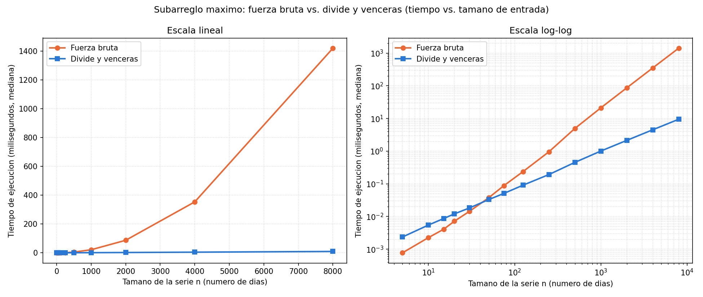

# Laboratorio evaluativo 02 — Dividir y vencer

**Autor:** Jhon Eduardo Zabala Garzon
**Correo:** jhonzabala329026@correo.itm.edu.co
**Grupo de Análisis:** 190304006-1
**Caso analizado:** cooperativa de tiendas de barrio — mejor racha de
variación de caja (subarreglo máximo)

---

## Cómo reproducir el experimento

Todo el código se ejecuta con el entorno virtual de la raíz del repositorio,
que ya tiene `matplotlib` registrado en `requirements.txt`.

```bash
# 1. Clonar y entrar al repositorio
git clone https://github.com/EduardoZabala/curso-analisis-algoritmos.git
cd curso-analisis-algoritmos

# 2. Crear y activar el entorno virtual (si aún no existe)
python3 -m venv .venv
source .venv/bin/activate          # Windows: .venv\Scripts\activate

# 3. Instalar las dependencias registradas
pip install -r requirements.txt

# 4. Ejecutar las pruebas y la medición
cd lab2-divide-y-vencer
python pruebas.py                  # Parte 1: casos con assert
python medicion.py                 # Parte 2: tablas + graficas/tiempo_vs_n.png + estimación
```

`pruebas.py` termina con `Todas las pruebas pasaron.`; si algún caso falla, se
detiene con un `AssertionError` que dice cuál. `medicion.py` tarda unos 15
segundos e imprime las tablas que aparecen en este informe. Las series se
generan con semilla `42`, así que los datos de entrada son idénticos en
cualquier máquina; los tiempos sí cambian entre corridas y equipos, pero la
forma de las curvas y las conclusiones no.

**Equipo donde se tomaron las mediciones de este informe:** Intel Core
i7-14700HX, 31 GB de RAM, Linux x86-64, CPython 3.14.7, matplotlib 3.10.6.

---

## Parte 1 — Implementar y verificar las dos soluciones

Código de esta parte: [`subarreglo.py`](subarreglo.py) (las tres funciones) y
[`pruebas.py`](pruebas.py) (las pruebas).

- `subarreglo_fuerza_bruta` fija cada día inicial `i` y avanza `j` desde `i`
  acumulando la suma, así cada par `(i, j)` cuesta una suma y una comparación.
- `suma_cruzada` barre desde `medio` hacia `inicio` y desde `medio + 1` hacia
  `fin`, guardando en cada lado la mejor suma y su índice; el tramo cruzado
  siempre tiene al menos un día de cada mitad.
- `subarreglo_maximo` resuelve el caso izquierdo (`inicio..medio`), el derecho
  (`medio + 1..fin`) y el cruzado, y devuelve el mejor. Trabaja con índices
  sobre la misma lista: no copia porciones ni llama a la fuerza bruta.

**Cómo verifiqué.** Cada caso fijo pasa por una función `comprobar` que, para
**los dos** algoritmos, revisa tres cosas: que la suma sea la esperada, que los
índices devueltos formen un tramo válido y que ese tramo realmente sume lo
reportado (así un error en los índices no pasa desapercibido aunque la suma
esté bien). También comprueba que la lista de entrada no cambió. Las sumas
esperadas las calculé a mano; los índices solo se comparan donde el óptimo es
único.

| Caso | Entrada | Suma esperada |
| --- | --- | ---: |
| Serie de ocho días del enunciado | `[-3, 5, -2, 8, -6, 3, 9, -4]` | 17 (días 2 a 7) |
| Un elemento (positivo y negativo) | `[7]`, `[-4]` | 7, −4 |
| Todos negativos | `[-8, -3, -6, -2, -5, -9]` | −2 |
| Todos positivos | `[4, 1, 7, 3, 2, 6, 5]` | 28 (serie completa) |
| Mejor tramo cruza el punto medio | `[-10, -1, 6, 5, 4, 3, -1, -10]` | 18 (izq. sola: 11, der. sola: 7) |
| Empates y ceros | `[3, -3, 3, -3, 3]`, `[0, 0, 0]` | 3, 0 |
| Decimales | `[1.5, -0.5, 2.25, -4.0, 3.0]` | 3.25 |
| 200 listas aleatorias | n entre 1 y 120, valores en [−100, 100], semilla 2026 | ambas funciones iguales |

Además pruebo `suma_cruzada` directamente: en el caso cruzado debe devolver
`(2, 5, 18)`, y en `[5, -1, -2]` debe tomar el día de la derecha aunque solo
reste (suma 2), porque el tramo cruzado está obligado a tener un elemento de
cada lado. El caso "todos negativos" es el que detecta el error típico de
inicializar la mejor suma en 0: con esa inicialización se reportaría 0, una
racha vacía que no existe.

---

## Parte 2 — Medir y graficar

Código de esta parte: [`medicion.py`](medicion.py).

**Cómo medí.**

- 14 tamaños: siete menores de 100 (5, 10, 15, 20, 30, 50, 75) para ubicar el
  cruce entre las curvas, y una cadena donde n se duplica en cada paso
  (125, 250, …, 4000, 8000) para calcular factores de crecimiento.
- Para cada tamaño genero **una sola** lista (semilla 42, enteros entre −100 y
  100) y la reciben los dos algoritmos. La generación queda fuera del reloj.
- Antes de cronometrar, el script verifica que ambos algoritmos devuelvan la
  misma suma y que la lista no cambie; si no, se detiene.
- Cronometro solo la llamada con `time.perf_counter()`, con el recolector de
  basura apagado durante la llamada para que sus pausas no se sumen al
  algoritmo.
- **Repetí todas las mediciones y grafico la mediana**: 101 veces para
  n ≤ 100 (tardan microsegundos y el ruido pesa más), 21 para n ≤ 1000 y 5
  para 2000, 4000 y 8000. Con esto atendí la observación del laboratorio
  anterior, donde los tamaños grandes se midieron una sola vez.



El panel izquierdo (escala lineal) muestra la forma de cada curva; en él la
curva de divide y vencerás queda pegada al eje. El derecho (log-log) permite
leer los tamaños pequeños y el punto de cruce.

| n | Fuerza bruta (ms) | Divide y vencerás (ms) | Fuerza bruta / DyV |
| ---: | ---: | ---: | ---: |
| 5 | 0.0008 | 0.0024 | 0.33 |
| 10 | 0.0023 | 0.0055 | 0.41 |
| 15 | 0.0041 | 0.0087 | 0.47 |
| 20 | 0.0072 | 0.0120 | 0.60 |
| 30 | 0.0145 | 0.0183 | 0.79 |
| 50 | 0.0374 | 0.0329 | 1.14 |
| 75 | 0.0880 | 0.0509 | 1.73 |
| 125 | 0.2365 | 0.0908 | 2.60 |
| 250 | 0.9588 | 0.1926 | 4.98 |
| 500 | 4.9589 | 0.4538 | 10.93 |
| 1000 | 21.2018 | 1.0087 | 21.02 |
| 2000 | 86.9091 | 2.1414 | 40.58 |
| 4000 | 353.3050 | 4.5146 | 78.26 |
| 8000 | 1419.5491 | 9.4756 | 149.81 |

Factor por el que se multiplica el tiempo cuando n se duplica:

| n → 2n | Fuerza bruta | Esperado Θ(n²) | Divide y vencerás | Esperado Θ(n log n) |
| --- | ---: | ---: | ---: | ---: |
| 125 → 250 | 4.05 | 4.00 | 2.12 | 2.29 |
| 250 → 500 | 5.17 | 4.00 | 2.36 | 2.25 |
| 500 → 1000 | 4.28 | 4.00 | 2.22 | 2.22 |
| 1000 → 2000 | 4.10 | 4.00 | 2.12 | 2.20 |
| 2000 → 4000 | 4.07 | 4.00 | 2.11 | 2.18 |
| 4000 → 8000 | 4.02 | 4.00 | 2.10 | 2.17 |

El factor esperado de n log n es 2·log₂(2n)/log₂(n): un poco más de 2, y se
acerca a 2 a medida que n crece.

---

## Parte 3 — Análisis

### 1. Recurrencia

Sea T(n) el tiempo de `subarreglo_maximo` sobre un rango de n días.

- **Caso base:** si `inicio == fin` devuelve ese único día: T(1) = Θ(1).
- **2 subproblemas** (a = 2): una llamada sobre `inicio..medio` y otra sobre
  `medio + 1..fin`.
- **De tamaño n/2** (b = 2): ⌈n/2⌉ y ⌊n/2⌋ días; el redondeo no cambia el
  orden.
- **Caso cruzado, f(n) = Θ(n):** `suma_cruzada` visita cada día del rango una
  sola vez con trabajo constante. Elegir el mejor de los tres es Θ(1).

**T(n) = 2T(n/2) + Θ(n).** Por el método maestro, n^(log_b a) = n^(log₂ 2) = n.
Como f(n) = Θ(n) = Θ(n^(log_b a)), estamos en el **caso 2**, y
**T(n) = Θ(n log n)**: log₂ n niveles, cada uno con n días de barrido.

**Fuerza bruta.** Para cada i el ciclo interno hace n − i iteraciones de costo
constante; en total n + (n−1) + … + 1 = n(n+1)/2. Sin salida temprana, es
Θ(n²) en todos los casos, no solo en el peor.

### 2. Lo medido contra lo esperado

En la escala lineal la fuerza bruta dibuja una parábola: de 353 ms en
n = 4000 sube a 1420 ms en n = 8000, mientras divide y vencerás apenas se
despega del eje (4.5 ms → 9.5 ms). En log-log ambas son rectas, y la de
fuerza bruta tiene el doble de pendiente.

Tomando 4000 → 8000: la fuerza bruta se multiplicó por **4.02** (Θ(n²)
predice 4) y divide y vencerás por **2.10** (Θ(n log n) predice 2.17).
Coinciden, y el resto de la cadena también (salvo 250 → 500 en fuerza
bruta, 5.17, que luego se estabiliza en ≈ 4).

### 3. Tamaños pequeños

Sí: en la tabla, divide y vencerás pierde en todos los tamaños hasta n = 30
(0.0183 ms frente a 0.0145 ms) y gana desde **n = 50** (0.0329 ms frente a
0.0374 ms) sin volver a perder.

La razón es la constante oculta. Ajustando cada modelo en n = 8000, cada
"operación" de divide y vencerás cuesta unos 9.1·10⁻⁸ s y cada una de fuerza
bruta 2.2·10⁻⁸ s: cuatro veces más. Divide y vencerás hace unas 2n llamadas
recursivas, y cada una crea un marco de pila, calcula el medio y arma tres
tuplas; la fuerza bruta solo suma y compara. Con pocos días ese costo fijo
pesa más que los pares que se ahorran.

### 4. ¿Cuándo conviene dividir?

Para hallar el máximo dividiendo: dos mitades (a = 2, b = 2) y combinar es
**una sola comparación**, f(n) = Θ(1). Entonces T(n) = 2T(n/2) + Θ(1); como
f(n) = O(n^(1−ε)) frente a n^(log₂ 2) = n, es el caso 1: **Θ(n)**. Recorrerlo
una vez también es Θ(n): no mejora, solo agrega llamadas.

En el subarreglo máximo el caso cruzado cuesta Θ(n), pero evita los Θ(n²)
pares de la fuerza bruta. En el máximo no hay nada que evitar: el recorrido
directo ya mira cada número una sola vez. Dividir paga solo cuando la
alternativa directa repite trabajo que la combinación ahorra.

### 5. Concepto para la gerente

Recomiendo **divide y vencerás**. *Estimación, no medición:* ajusté cada modelo
a mi medición más grande (n = 8000) —fuerza bruta c·n², divide y vencerás
c·n·log₂ n— y lo evalué en 1.000.000. No uso regla de tres porque el tiempo no
crece en proporción a n: con regla de tres la fuerza bruta daría ~3 minutos,
125 veces menos de lo esperado.

| Serie | Fuerza bruta | Divide y vencerás |
| --- | ---: | ---: |
| 1.000.000 de registros | ≈ 22.200 s ≈ **6.2 h** | ≈ **1.8 s** |

Con el volumen actual (1.500 tiendas de 2.000 días) ambos sirven: ~2.2
minutos contra ~3 segundos. Pero una sola serie de sensores de un millón de
registros ocuparía 6 horas con fuerza bruta. Supuesto: mismo equipo y Python.
